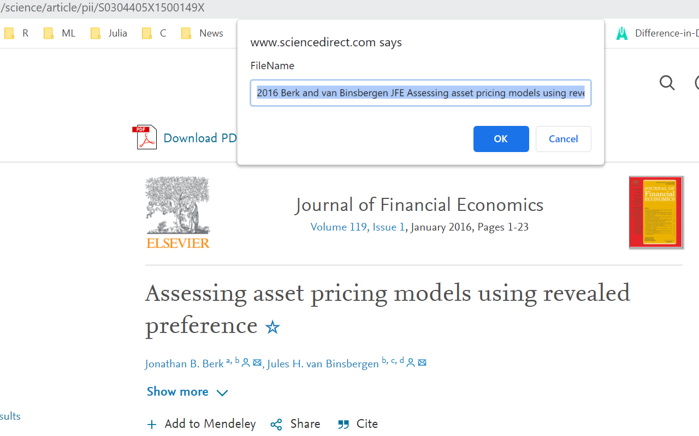
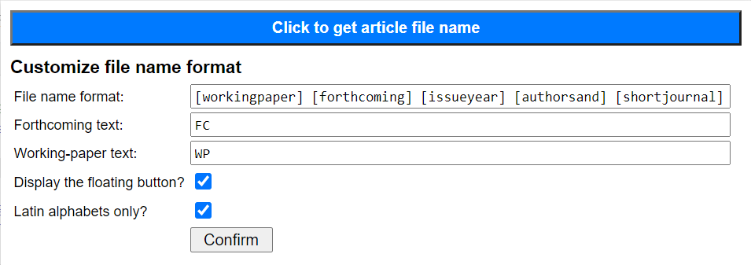

# Get Article File Name 
Current Version: 2.0.10

## Motivation

Downloading academic articles is a routine in a researcher's life. Different people have different conventions to rename these pdf-format articles. I have adopted a more detailed approach with the year, last names of the authors, and the title showing up in the pdf file name. However, it is tedious and time-consuming to type such information every time when I download an article. Therefore, I develop this extension to facilitate this procedure.

## Introduction

This extension parse the article website to get information about the article and generate a file name for the article in a textbox of a dialog box. The file name is already in selection, so the user can directly hit `Ctrl+C` to copy the generated file name and then rename the article to be downloaded.

The current version allows the user to customize the format of the generated file name. Several pre-defined variables are provided, such as author names in different formats. This can be changed in the extension pop-up window. A floating button is also generated on websites that the extension supports. The user can simply click on the floating button to trigger the dialog box.

## Installation

This extension is available in the [Chrome Web Store](https://chrome.google.com/webstore/detail/get-article-file-name/aopacmmlepabhmbdamhgdgocjgpgfnph).

Users can also install the extension using the current repository (updated faster since it takes time for Chrome to approve):

* Download the repository and unzip all files into a folder (e.g. `get-article-file-name`).
* Open Chrome, click on the three vertical dots on the top right and then choose "More Tools" and then "Extensions".
* In the opened tab, toggle on "Developer mode" on the top right of the page and a new toolbar will appear at the top.
* Click on "Load unpacked" and choose the folder where you unzip all files (e.g. `get-article-file-name`) and click on "Select Folder". Then, the extension will appear on the page.

NOTE: If you do not see the icon of this extension () on the extensions toolbar, check [here](https://superuser.com/a/1569004) for more info. 

## Usage

### Generate file name

Go to the website of an article. Then, there are two ways to trigger the dialog box containing the generated file name:

* Click on the floating button () on the right side of the webpage.
* Click on the icon of this extension and click on the long button. 

Then, a dialog box will show up with the generated article file name in selection (see the following screenshot). You can simply use `Ctrl+C` to copy the name and rename the pdf-file of the article downloaded.

Access to the content of the article is not required since only free citation info is parsed.

NOTE: Here "the website of an article" represents the webpage with the HTML-format of the article, not the pdf-file of the article. An example is this [link](https://www.sciencedirect.com/science/article/pii/S0304405X1500149X).

### Customization

To customize the format of the file name, click on the icon of this extension () on the extensions toolbar (to the right of the address bar). The following window will show up:

Details about these options are as follows:

* **File name format**: Fill in the file name format in this textbox. The default is `[workingpaper] [forthcoming] [issueyear] [authorsand] [shortjournal] [fulltitle]`. Texts enclosed by brackets represent pre-defined variables (see below). Other characters than the pre-defined variables will be shown in the file name as is. More than one consecutive spaces will be replaced by one space.
* **Forthcoming text**: This is the string that represents the `[forthcoming]` variable if the article is forthcoming. The default is `FC`.
* **Working-paper text**: This is the string that represents the `[workingpaper]` variable if the article is from SSRN or Arxiv. The default is an empty string.
* **Display the floating button?**: Check this box if you want the floating button on the supported webpages. The default is true.
* **Latin alphabets only?**: Check this box if you want to convert all accentuated letters (in author names or title) to the corresponding latin alphabets (e.g. é to e). The default is true.

Click on the "Confirm" button to confirm your choice and then **refresh** the webpage for it to take effect.

### Pre-defined variables

* Author names
    * `[auth]`: The last name of the first author
    * `[auth1etal]`: The last name of the first author, and "et al" if there are more than one.
    * `[auth2etal]`: The last name of the first author, and the last name of the second author if there are two authors or "et al" if there are more than two.
    * `[authors]`: Last names of all authors without "and"
    * `[authorsand]`: Last names of all authors with "and" between the last two if there are more than one.
    * `[authinit1]`: The first letters of the last names of all authors combined and capitalized, e.g. "BY" for Bansal and Yaron.

* Title
    * `[shorttitleN]`: The first `N` words of the title, ignoring any function words (see below).
    * `[shorttitleinitN]`: The first letters of `[shorttitleN]` combined and capitalized.
    * `[camel]`: Capitalize the first letter of all words in the title and concatenate them without space.
    * `[fulltitle]`: Full title unchanged.
    * For all title-related variables, the following symbols are removed from the title: ``: , ? / * ! " ` & ( ) . “ ”``.

    I use the function words defined by JabRef: "a", "an", "the", "above", "about", "across", "against", "along", "among", "around", "at", "before", "behind", "below", "beneath", "beside", "between", "beyond", "by", "down", "during", "except", "for", "from", "in", "inside", "into", "like", "near", "of", "off", "on", "onto", "since", "to", "toward", "through", "under", "until", "up", "upon", "with", "within", "without", "and", "but", "for", "nor", "or", "so", "yet".

* Year
    * `[issueyear]`: Year of the published issue. For forthcoming articles without an official published year, this variable is set to be `[onlineyear]` defined below. For SSRN or Arxiv articles, this variable is the year of "Last Revised" if it is available and the year of "Posted" otherwise.
    * `[onlineyear]`: Year of first available online in the publisher, which may not be equal to the year of the published issue. For AEA journals, the year available online is not available, so this variable is set to empty. For SSRN or Arxiv articles, this variable is the same as `[issueyear]`.

* Journal
    * `[fulljournal]`: Full journal name. For SSRN (Arxiv) articles, this variable is equal to `"SSRN"` (`"Arxiv"`).
    * `[shortjournal]`: First letter of each word in the journal name excluding "of" and "&", allowing for special treatment (see below). However, if the journal name contains only uppercase letters (without spaces), then we consider it as the abbreviation and set `shortjournal` as identical to the journal name.

    List of journal names with special abbreviation: Econometrica-`ECTA`, Review of Economic Studies-`ReStud`, Review of Economics and Statistics-`ReStat`, RAND Journal of Economics-`RAND`, Journal of Public Economics-`JPub`, AEJ: Macroeconomics-`AEJMa`, AEJ: Microeconomics-`AEJMi`, SSRN-`SSRN`, Arxiv-`Arxiv`.

* Forthcoming
    * `[forthcoming]`: A string equal to the user's choice for forthcoming articles and empty otherwise.

* SSRN or Arxiv working paper
    * `[workingpaper]`: A string equal to the user's choice for SSRN or Arxiv working paper and empty otherwise.

## Publishers currently supported

Currently, the following publishers are supported. More will be added at request:

* AEA: American Economic Review, AEJ: Macroeconomics, etc.
* Allenpress: The Accounting Review
* Arxiv.org
* Cambridge: Journal of Financial and Quantitative Analysis, etc.
* Elsevier: Journal of Financial Economics, Journal of Monetary Economics, Journal of Banking & Finance, etc.
* INFORMS: Management Science, etc.
* MIT Press: Review of Economics and Statistics, etc.
* Oxford: Review of Financial Studies, etc.
* SSRN
* Taylor & Francis: Journal of Business & Statistics, etc.
* UChicago: Journal of Political Economy, etc.
* Wiley: Journal of Finance, Econometrica, etc.
* ACM
* IEEE

## Future plan

No more future plans now. Suggestions welcomed.
